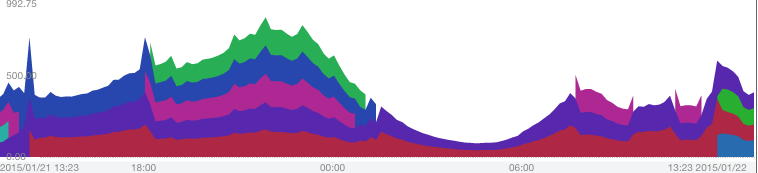
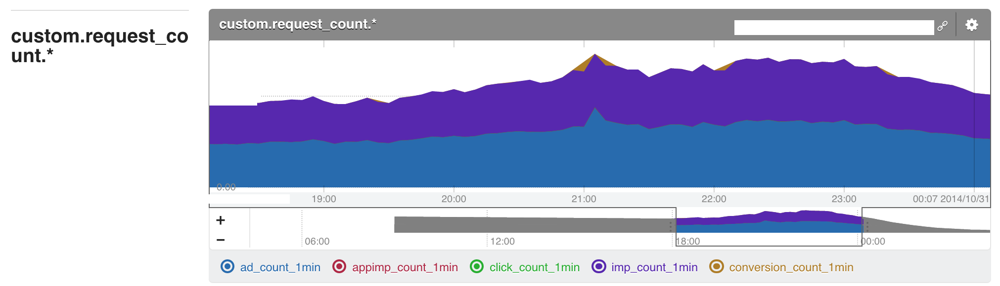

# Mackerelを中心に考える2015年代のサービス運用環境

id:myfinder

___

# 自己紹介
- 久森 達郎
- エム・ティー・バーン株式会社
 - サーバサイド / Android

---

# 今日話すこと
- "どオンプレ環境"で作ったサービスを最近 AWS に移設しました
- Mackerelを中心に運用環境を大きく変えました

___

# 対象のサービス
## http://mtburn.jp/

___

## メディア企業の皆様
# どしどしお申込み
# ください

---

# 移行前の環境
オンプレ+S3/CloudFront(とか他のCDN)

___

# 移行前の環境
- Single Segment
- データセンター提供のマネージドDNS
- 箱物ロードバランサ / 大手メーカー製サーバ / 一部自作機
- CentOS 6.x / cobbler / puppet / RackTables
- Hadoop 担当が構築 / 運用
- MySQL/Redis 担当が構築 / 運用
- Nagios / CloudForecast / GrowthForecast
- 足元のディスクに吐いたログをでっかいサーバに収集して集計

___

# よくある消耗しがちなオンプレ環境でした

---

# 抱えていた懸案
## __"調達"__と__"実装スピード"__

___

## 急速に立ち上がっている状況

___

## 課題
- サーバの性能が箱で規定されるので、複雑なプロビジョニングを必要とする
- 新規リソースの調達リードタイムが大きい
- キャパシティを見切る事が難しい

___

## 解決するには？
- クラウドへ移行すれば半分解決できる
- 残りの半分は？

___

## 考え方/仕組みを変える
- マネージドを積極的に活用する
- 運用の考え方を180度変える必要がある

___

## 変えた点
- Mackerelをサーバ管理の中心にする
 - Nagios/CF/GF/Puppet/RackTables -> Mackerel
- マネージドサービスの活用
 - Route53/ELB/EC2 AutoScaling/RDS/ElastiCache
 - BigQuery
- ツール/オペレーションの改善
 - ログ収集方法の変更
 - Puppet廃止、Packer採用
 - デプロイ方法の変更

___

# つまり
# アプリ以外全部
# 変えた

---

## Mackerelをサーバ管理の中心に
- マネージドでサーバリストメンテが不要になる
- Roleベースでの管理/グラフの継続
- サービスメトリックが捗る
- 開発者が身近

___

# グラフの連続性

___

## roleベースでグラフは継続

___

# CloudWatch連携

___

## 公式の手順でカジュアル

___

# Norikraの活用

___

## fluent-plugin-(norikra|mackerel)でOK

___

## 分速で売上/支払を見る

___

# Mackerel + Slack

携帯がアラートメールでうめつくされるみたいなのもなくなった

---

# マネージドサービスの活用

___

## Route53/RDS/ElastiCache
- 内部DNSもRoute53で扱えるようになったので移行
 - 但しほとんどのサーバには名前をつけていないのであまり必要なくなった
- MySQLやRedisは自前運用しない
 - フェイルオーバーやバックアップを勝手にやってくれたほうがいい

___

## ELB/EC2 AutoScaling
- MackerelとAutoScalingは先述のとおり相性良好

___

## BigQuery
- Hiveと比較してコスト/速度/スケーラビリティすべてで勝っている
- もはや使わない理由がない

---

# ツール/オペレーションの改善

___

## ログ収集方法の変更
- 足元のストレージに吐いたログをscpとかで収集して集計していた
- fluentdでS3/BigQueryへ収集するよう変更
- fluentd自体のログもslackへ投げてトラブル検知

___

## Puppet廃止、Packer採用
- EC2ではインスタンスタイプで必要なリソースを必要な機能単位で割り当てられる
- オンプレのように箱の性能に合わせたプロビジョニングが不要になる
- Packer + ShellScript で AMI を作ってしまえば十分

___

## デプロイ方法の変更
- S3を介したpull型deployへ
 - 種サーバでビルドしたものをS3に同期
 - 各サーバはS3から取得する
 - 操作自体はCapistranoのMackerel連携で十分
 - AutoScalingする際はcloud-initで取得処理を走らせる

---

# 結果
- Mackerelを中心にサービス運用を考えた結果
 - 結果としてInfrastructure as Codeを実践することになった
 - 労働集約的な仕事から開放された
 - 仕事の質をアップさせ、更に新しいことに取り組めるようになった

---

# 質疑など?

---

# おわり
